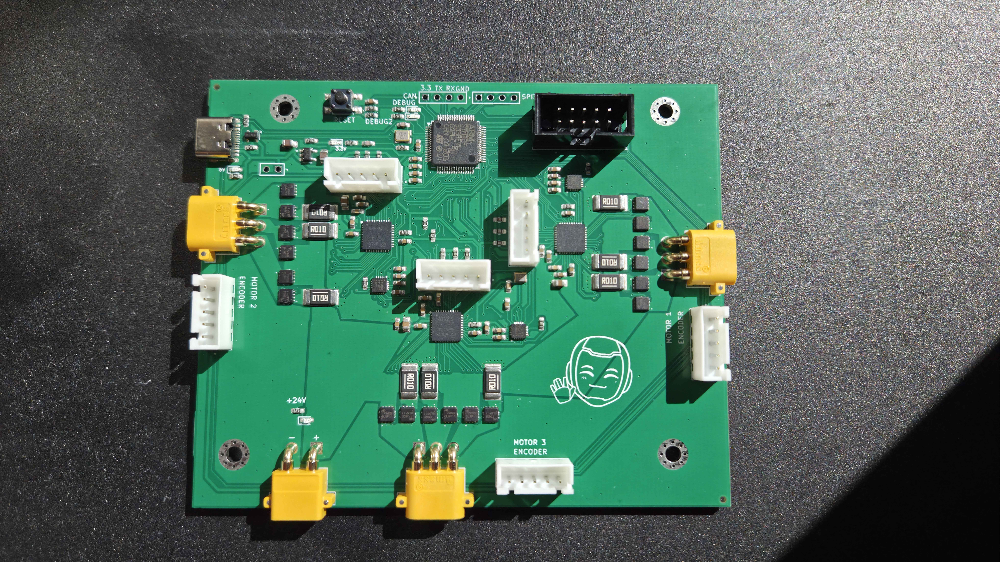

# Kullamae-thesis-2026-Wheelbase

> **Master's Thesis:** *Controller for the Mobility Subsystem of the SemuBot Social Humanoid Robot*
> University of Tartu · 2026 · Kaur Kullamäe
 


*Variant 2 (ros2_control + micro-ROS) running on the SemuBot wheelbase*

---

## Overview
 
This repository contains all hardware design files, STM32 firmware, and a ROS 2 workspace developed for the **SemuBot wheelbase mobility subsystem** — a compact, ROS 2-compatible replacement for the previous wheelbase electronics.
 
The previous design used three separate commercial BLDC driver modules controlled via Raspberry Pi PWM. This project consolidates everything onto a single custom STM32-based controller board, dramatically reducing size, weight, and system complexity while adding robust ROS 2 and `ros2_control` integration.
 
The project focuses on replacing the previous bulky SemuBot wheelbase electronics with a compact STM32-based controller board supporting:
 
- 3 BLDC motors
- 3 DRV8353 gate drivers
- 3 absolute SSI encoders
- STM32F303RET6 microcontroller
- USB CDC communication
- micro-ROS communication
- ROS 2 integration
- `ros2_control` support

---

## Hardware Overview
 


*Custom STM32 controller board*
 
| Parameter | Value |
|---|---|
| Microcontroller | STM32F303RET6 (Cortex-M4, 72 MHz) |
| Gate drivers | 3× DRV8353 (3-phase, SPI-configurable) |
| Encoder interface | 3× SSI absolute encoder (AMT232A) |
| Current sensing | ADS131M03 (3-channel, 24-bit ADC, SPI) |
| Communication | USB CDC (virtual COM) + UART (micro-ROS) |
| Power input | 24 V nominal |
| PCB tool | KiCad 9 |
 


---

## Getting Started
 
### 1. Clone the repository (with submodules)
 
```bash
git clone --recurse-submodules https://github.com/SemuBot/Kullamae-thesis-2026-Wheelbase.git
cd Kullamae-thesis-2026-Wheelbase
```
 
If you already cloned without submodules:
```bash
git submodule update --init --recursive
```
 
### 2. Build the firmware
 
1. Open **STM32CubeIDE**
2. Import `semubot-firmware/` as an existing project
3. Select the build configuration matching your variant (e.g. `microros_ros2control`)
4. Build → Flash via ST-Link (Run → Debug, or `st-flash`)

### 3. Build the ROS 2 workspace
 
```bash
cd wheelbase_ws
source /opt/ros/jazzy/setup.bash
rosdep install --from-paths src --ignore-src -r -y
colcon build --symlink-install
source install/setup.bash
```
 
### 4. Launch
 
```bash
# Variant 2: ros2_control + micro-ROS
ros2 launch semubot_ros_control semubot_control.launch.py
 
```

* This launches Joy, micro-ROS agent, and ROS_control.
 
## Repository structure

```text
Kullamae-thesis-2026-Wheelbase/
├── semubot-electronics/
├── semubot-firmware/
├── wheelbase_ws/
├── .gitignore
├── .gitmodules
├── LICENSE
└── README.md
